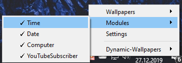
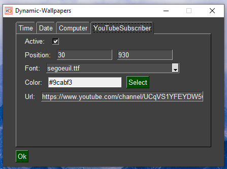
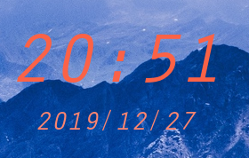
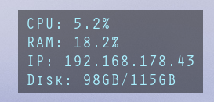
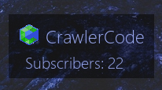
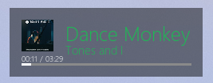

Dynamic-Wallpapers
==================

    - Each module can be personalized: Position, Font, Color and more Settings

Modules
=======

Module - Time/Date
------------------

    - Function: show time and date

Module - Computer
-----------------

    - Function: display ip, cpu, ram and disk stats

Module - YouTubeSubscriber
--------------------------

    - Function: show youtube channel (icon and name) and current subscribers

Module - Spotify
----------------

    - Function: show the current playing music
    - Requirement: Permission to your spotify account (no email or password)

