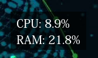

Dynamic-Wallpapers
==================

Module - Time/Date
------------------

    - Function: show time and date
    - Position: middle of screen

.. image:: doc/module_time_date.png
    :width: 300

Module - CPU/RAM
----------------

    - Function: display cpu and ram stats
    - Position: right top corner

Module - YouTubeSubscriber
--------------------------

    - Function: show youtube channel (icon and name) and current subscriber
    - Position: left bottom corner

.. image:: doc/module_youtube_subscriber.png
    :width: 300